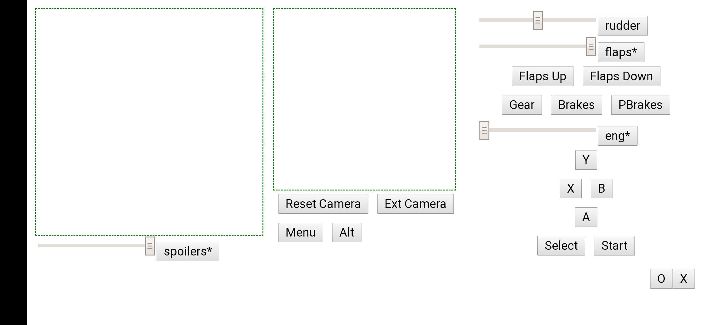

## Explanation
Uses [vJoy](http://vjoystick.sourceforge.net/joomla/) to emulate a virtual joystick. Python is used to the load the vJoy dll, and communicates with a react web app to recieve joystick commands from a website. This can run on any phone or desktop.

## Basic UI

Basic proof of concept.