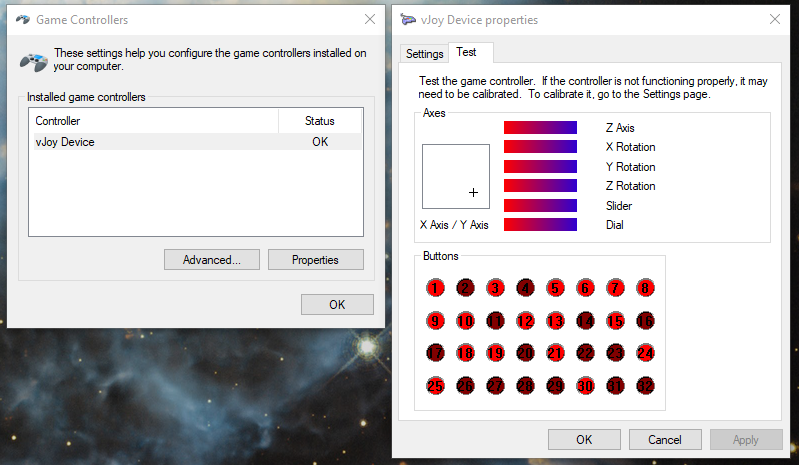
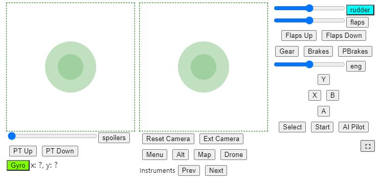

## Explanation
Uses [vJoy](https://github.com/jshafer817/vJoy) to emulate a virtual joystick. 
Python is used to the load vJoy.dll, and communicates with a react web app to recieve joystick commands from a website. This can be run on any phone or desktop.

### 1. Installing vJoy
[Install vJoy](https://github.com/jshafer817/vJoy/releases) by install <code>vJoySetup.exe</code>.

Script needs a vJoy device, so run "vJoyConf.exe" in the vJoy install location or from start menu (C:/Program Files/vJoy/x64/vJoyConf.exe).

Currently script uses the following settings: 
- vJoy device: 1
- All axes enabled
- 32 buttons
- Effects disabled (vibration etc)

### 2. Testing virtual joystick
1. Open **Set up USB game controllers** on windows
2. Select **vJoy Device**
3. Click on properties
4. Run the following test script
```bash
    cd controller
    python test_vjoy.py
```
5. Check if the buttons and dials update


### 3. Setting up virtual joystick server
```bash
cd controller
pip install virtualenv
python -m virtualenv venv
source venv/Scripts/activate
pip install -r requirements.txt

```

### 4. Running virtual joystick server
```bash
cd controller
python serve_website.py
# CTRL-C to terminate
# go to your localaddress to get ui
# E.g. localhost:3000, 192.168.x.x:3000
```

## Example UI
### UI for Microsoft Flight Simulator 2020.


### Changing UI
UI is written using ReactJS. Run below commands to start development server.

Refer to <code>controller/on_packet.py</code> to see the server side structure of the packets.

Refer to <code>web/vjoy/src/Controller.js</code> to see the client side structure of the packets.


```bash
cd web/vjoy
# OPTIONAL: install npm modules
# You need yarn and node for this
yarn install
# run the development server for react website
yarn start
# build the website once you are done
yarn build
```
